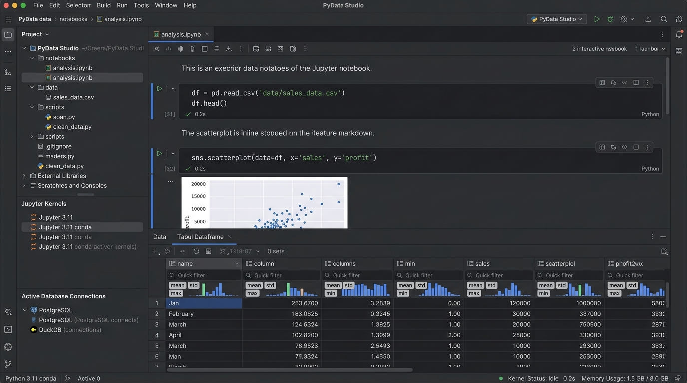
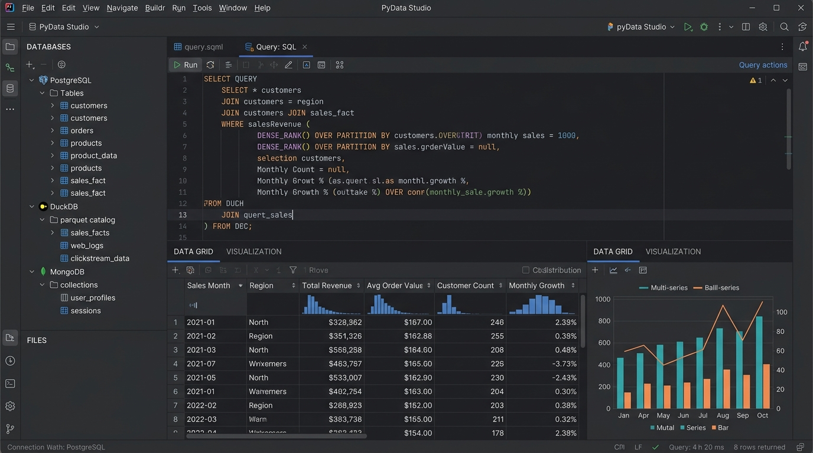
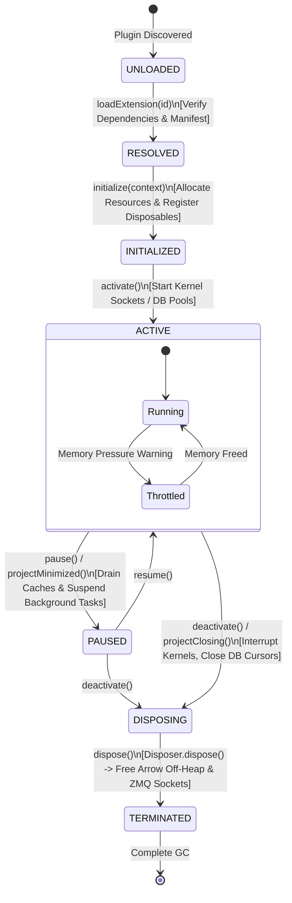
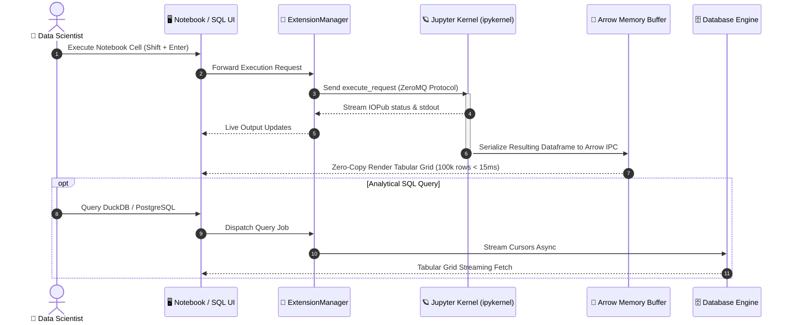
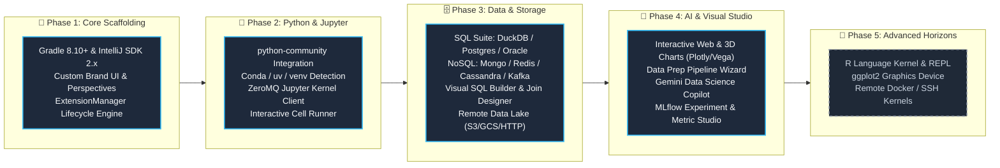

# 🐍 Jörmungandr 🌊

### *The Modular, Open-Source IDE for Python, Data Science & Analytics*

[](https://github.com/JetBrains/intellij-community)
[](https://kotlinlang.org)
[](https://github.com/JetBrains/intellij-community/tree/master/python)
[](https://jupyter.org)
[](LICENSE)

---

## 🌟 1. Executive Summary & Project Brief

Modern data practitioners are caught between two disparate worlds:
- **Web-based Notebooks** (e.g. JupyterLab) offer immediate visualization and exploratory freedom, but fall short on refactoring, static typing, deep debugging, and enterprise-grade VCS.
- **Traditional Software Engineering IDEs** provide industrial-strength code intelligence, but treat notebooks, dataframes, and database exploration as secondary utilities or lock them behind expensive commercial paywalls.

**Jörmungandr** bridges this divide. Built atop the open-source **IntelliJ Platform Community Edition** and JetBrains' open-source **Python Community** plugins, Jörmungandr delivers a purpose-built, responsive environment tailored specifically for **Data Scientists**, **Analytics Engineers**, and **Machine Learning Practitioners**.

```
   ┌────────────────────────────────────────────────────────────────────────┐
   │                                                                        │
   │   🔬 EXPLORATORY AGILITY             🛠️ PRODUCTION ENGINEERING          │
   │   • Reactive Jupyter Notebooks       • PSI AST Code Refactoring        │
   │   • Tabular Dataframe Grids          • pydevd Step-Through Debugger    │
   │   • SQL/NoSQL Live Analytics         • Git & Merge Conflict Tools      │
   │   • In-Memory DuckDB / Polars        • Strict Typing & Linting (Ruff)  │
   │                                                                        │
   │                     ⚡ UNITED IN JÖRMUNGANDR ⚡                        │
   └────────────────────────────────────────────────────────────────────────┘
```

---

## 🎨 2. Planned UI Mockups & Visual Design (Concept Targets)

> [!IMPORTANT]
> **🚧 Work-in-Progress (WIP) Notice: Concept Mockups Only**  
> The images shown below are **planned conceptual mockups and UI design targets**, **NOT** actual screenshots of the running software. Jörmungandr is currently an active work-in-progress (WIP). These visual mockups illustrate the target user experience, interface layout, and aesthetic direction. As functional milestones are completed, these mockups will be progressively replaced with actual screenshots from live builds.

### 🖼️ Planned Mockup 1: Primary IDE Workspace (Interactive Notebook & Tabular Dataframe Explorer)
> *⚠️ Note: Planned Concept Mockup — Not an actual screenshot (Product WIP)*



**Planned Layout Highlights:**
1. **Left Activity Bar & Tree**: Project explorer, active Jupyter kernel manager, and live database connection status.
2. **Central Notebook Canvas**: Rich Markdown rendering, executable Python cells, and inline Seaborn/Matplotlib charts.
3. **Bottom Tabular Dataframe View**: Virtualized grid rendering with per-column distribution histograms, min/mean/max indicators, and quick-filter bars.
4. **Contextual Status Bar**: Real-time Python environment tag, kernel latency (`Idle 0.2s`), and memory consumption monitor.

---

### 🖼️ Planned Mockup 2: Analytical SQL/NoSQL Console & Visualizer
> *⚠️ Note: Planned Concept Mockup — Not an actual screenshot (Product WIP)*



**Layout Highlights:**
1. **Unified Schema Explorer**: Hierarchical introspection of PostgreSQL tables, DuckDB parquet catalogs, and MongoDB collections.
2. **Analytical Query Editor**: High-speed SQL editor with window function highlighting, smart autocomplete, and execution timer.
3. **Dual Data Grid & Charting Pane**: Side-by-side data grid inspection and interactive multi-series bar/line visualization.

---

### 🖼️ Mockup 3: Extension & Memory Management Control Center
*Dedicated control panel for managing active extensions, tracking off-heap memory, and monitoring resource quotas.*

```
┌──────────────────────────────────────────────────────────────────────────────────────────┐
│ 🧩 Jörmungandr — Extension & Memory Manager                                      [—][□][✕]│
├──────────────────────────────────────────────────────────────────────────────────────────┤
│ Filter Extensions: [ Search active plugins...            ]   [ 🔄 Refresh ] [ ⚙️ Quotas ] │
├────────────────────────────────┬─────────┬──────────────┬──────────────┬────────────────┤
│ Extension Name                 │ State   │ Heap / Off   │ Thread Pool  │ Actions        │
├────────────────────────────────┼─────────┼──────────────┼──────────────┼────────────────┤
│ 🪐 Jupyter Kernel Subsystem    │ 🟢 Active│  48 MB / 0 MB│ 4 workers    │ [⏸️ Pause] [✕] │
│ 🗄️ DuckDB In-Memory Engine    │ 🟢 Active│ 112 MB / 2 GB│ 8 workers    │ [🧹 Trim]  [✕] │
│ 🏹 Apache Arrow Buffer Grid    │ 🟢 Active│  64 MB / 1 GB│ 2 workers    │ [🧹 Trim]  [✕] │
│ 🍃 MongoDB Document Connector  │ 🟡 Paused│  18 MB / 0 MB│ Idle         │ [▶️ Resume] [✕] │
│ 📈 JCEF Chart Canvas Bridge    │ 🟢 Active│  95 MB / 0 MB│ Render Thread│ [🔄 Reload][✕] │
│ 📊 R-Language Language Server  │ ⚪ Ready │   0 MB / 0 MB│ Unloaded     │ [⚡ Activate]   │
├────────────────────────────────┴─────────┴──────────────┴──────────────┴────────────────┤
│ 💾 Total Memory Governed: Heap 337 MB | Off-Heap 3.0 GB | JVM Quota: 8.0 GB (38% Used)   │
│ 🛡️ Lifecycle Health: All parent/child disposables linked • Zero orphan socket handles  │
└──────────────────────────────────────────────────────────────────────────────────────────┘
```

---

## 🎯 3. Scope of the Project

### 3.1 👥 Target Audience
- **Data Scientists & Machine Learning Engineers**: Developing predictive models, feature pipelines, and Jupyter exploratory workflows.
- **Analytics Engineers & Data Analysts**: Writing analytical SQL, exploring datasets with DuckDB/Polars, and debugging data transformations.
- **Python Engineers working with Data**: Creating data-intensive services, FastAPI endpoints, and ETL jobs.

### 3.2 ✅ In-Scope (Phase 1 / MVP)
- **IntelliJ Platform CE Base**: Custom branding, simplified data-first perspectives (Code, Notebook, Database).
- **Python Community Tooling**: Complete virtualenv support (`venv`, `conda`, `poetry`, `uv`), AST code insight, refactoring, and pydevd debugging.
- **Interactive Jupyter Subsystem**:
  - Full `.ipynb` notebook editor with split code/output cells.
  - ZeroMQ client communicating directly with local/remote Jupyter kernels.
  - Variable inspector showing type, shape, and memory consumption.
- **Database & Data Source Suite**:
  - SQL engine support: PostgreSQL, MySQL, SQLite, DuckDB, Snowflake, Oracle PL/SQL.
  - NoSQL & Streaming engine support: MongoDB, Redis, Apache Cassandra (CQL), Apache Kafka.
  - Remote Data Lake & Object Storage explorer: Amazon S3, Google Cloud Storage, HTTP/REST.
  - Visual No-Code / Low-Code SQL & Join Builder with multi-dialect and DataFrame export.
  - Schema tree explorer, visual ER diagram, query console, and streaming tabular data grid.
- **Interactive Visualizations & Machine Learning Studio**:
  - Interactive Web & 3D Visualizations: Plotly, Altair, Vega-Lite, Folium, ECharts via embedded Chromium.
  - In-IDE Machine Learning Experiment Tracker & Metric Studio (MLflow-style leaderboards and step-series convergence curves).
  - In-IDE Data Science Copilot powered by Google Gemini AI & offline heuristic intelligence.
  - Low-code Data Prep Studio transformation pipeline wizard with Pandas, Polars, and SQL generation.
- **Modular Extension Manager**:
  - Strict lifecycle states (`UNLOADED` &rarr; `ACTIVE` &rarr; `DISPOSING` &rarr; `TERMINATED`).
  - Memory bounds and IntelliJ `Disposable` hierarchy integration.

### 3.3 🔮 Follow-Up Scope (Future Horizons)
- **R Language Integration (TBD)**: R kernel integration, R REPL, package viewer, and graphics device window.
- **Hardware-Accelerated Visualization**: WebGL/Skiko canvas for 10M+ datapoint scatterplots.
- **Remote Compute**: Remote Docker & SSH Jupyter kernel runners.

---

## 🏗️ 4. Planned Architecture

Jörmungandr is structured into five decoupled layers to ensure that high-memory data operations never freeze the core editor or leak system resources:


---

## 🔄 5. Extension Manager & Lifecycle Specification

Data science workflows manipulate multi-gigabyte memory buffers and long-lived network sockets. Unlike conventional plugins, extensions in Jörmungandr operate under a **deterministic lifecycle state machine** governed by IntelliJ's `Disposable` infrastructure:



### 🛡️ Core Guarantees
1. **Memory Quota Enforcement**: If an extension exceeds its declared memory quota (e.g. holding uncompressed dataframes), `trimMemory()` is invoked automatically.
2. **Leak-Free Disposal**: Every extension implements `com.intellij.openapi.Disposable`. On project teardown, `Disposer.dispose(extension)` guarantees zero dangling threads, processes, or file descriptors.
3. **Crash Protection**: If an external kernel or database driver crashes, the Extension Manager captures the fault, isolates the module, and keeps the IDE editor responsive.

---

## 📡 6. Data & Execution Flow



---

## 🗺️ 7. Milestone Roadmap



| Phase | Milestone | Focus Areas | Deliverables |
| :--- | :--- | :--- | :--- |
| **Phase 1** | 🏛️ Platform Core | Shell, Branding, Extension Manager | IntelliJ CE base, module build system, `ExtensionManager` state machine, `Disposable` tree. |
| **Phase 2** | 🐍 Python & Notebooks | Runtime & Interactive REPL | `python-community` integration, environment switcher, ZeroMQ v5 client, `.ipynb` editor. |
| **Phase 3** | 📊 Data & Storage | Databases & Data Lakes | Multi-dialect SQL & NoSQL consoles, DuckDB OLAP, Cassandra CQL, Kafka streams, Visual SQL Builder, S3/GCS Data Lake. |
| **Phase 4** | 🧪 AI & Visual Studio | Copilot, Web Viz & ML | Plotly/Vega 3D & Web Studio, Data Prep Studio pipeline wizard, Gemini AI Copilot, ML Experiment Studio. |
| **Phase 5** | 🔮 Horizons *(TBD)* | R Language & Remote Compute | R kernel and REPL bridge, ggplot2 device canvas, remote SSH/Docker compute runners. |

### 📝 Backlog & Priority TODO Items
- [ ] **Comprehensive Rebranding & White-Labeling (JetBrains / IntelliJ IDEA &rarr; Jörmungandr)**:
  - Systematically eliminate all remaining upstream IntelliJ IDEA and JetBrains branding, logos, splash text, dialog headers, window titles, menu bar labels, and about screens in favor of custom Jörmungandr identity.
  - Move application metadata, bundle IDs, paths selectors (`idea.paths.selector`), and vendor attributes to strictly isolated Jörmungandr (`indoctrinatedrecluse`) namespaces.
  - Implement full custom theme and icon overhaul ensuring zero upstream JetBrains trademarked assets or UI strings leak into the user-facing experience.

---

## 🖥️ 8. Accessing Extension UIs in Jörmungandr

Jörmungandr exposes its data science tooling through native editors, dedicated tool windows, tailored perspectives, and standard IntelliJ menus. Here is how users can access every UI:

### 📊 1. Flagship DataFrame Studio & Tabular Viewer
The flagship DataFrame Studio provides exploratory data analysis, visual vector charting, column statistics, dynamic pivot tables, and embedded in-memory SQL querying.

- **Opening Datasets via File Association**:
  - In the **Project Explorer** tree (`Alt + 1`), double-click any `.csv`, `.tsv`, or `.parquet` (Apache Parquet) dataset.
  - The IDE automatically opens the file using the high-performance `DataFrameFileEditor`.
- **Opening Datasets via Context Menu**:
  - Right-click any dataset file in the project tree &rarr; choose **Open with DataFrame Studio**.
- **Opening the Tool Window**:
  - Main menu: `View` &rarr; `Tool Windows` &rarr; `DataFrame Viewer`.
  - Or click the **DataFrame Viewer** button on the bottom/right tool window stripe.
- **Features Inside the Studio**:
  - 📋 **Grid View Tab**: High-speed virtualized data table with sortable columns, instant full-text search, **🎨 Heatmap** numeric cell gradient formatting, **Σ Describe** summary dataset generator, **Group By ▾** aggregations, **Columns ▾** visibility selector, **🔍 Filter Builder** (compound multi-condition filtering with `>`, `<`, `=`, `!=`, `contains`, `regex`), **⚡ Code ▾** exporter (generate Pandas, Polars, and SQL DDL / Inserts), and **💾 Export ▾** (copy as CSV, TSV, Markdown, JSON, JSON Lines `.jsonl`, or Excel XML `.xml`).
  - 📊 **Right Statistical Inspector**: Detailed per-column summary metrics (null counts & percentages, distinct values, min, max, mean, median, 25%/75% quantiles, IQR, standard deviation, skewness) and inline distribution bar histograms.
  - 🧙 **Data Prep Studio Tab**: Low-code data cleaning and transformation pipeline wizard. Interactively assemble sequential transformation steps:
    - **Drop Missing Values**: Drop rows with nulls across all or selected columns.
    - **Impute / Fill Missing**: Fill NaNs with Column Mean, Median, Mode, Constant value, or Forward-fill.
    - **Type Casting**: Safe conversion between Integer, Float, String, and Boolean.
    - **String Cleaning**: Strip whitespace, lowercase, uppercase, and regex search/replace.
    - **Numerical Scaling**: Standard Scaler ($Z = \frac{x - \mu}{\sigma}$), Min-Max Scaler ($[0, 1]$), and Robust IQR Scaler.
    - **Outlier Clipping**: Winsorization by standard deviation ($k \cdot \sigma$) or quantile bounds ($[p_1, p_2]$).
    - **Deduplication & One-Hot Encoding**: Drop duplicate rows and expand categorical values into binary indicator columns.
    - **Rename & Drop Columns**: Clean up schema headers and eliminate unneeded features.
    - **Live Preview & Code Generation**: Live transformed preview grid, reorderable step cards, copyable scripts for **Pandas**, **Polars**, and **SQL**, plus **"⚡ Apply Pipeline to Grid"** to update the active table.
  - ✨ **Data Copilot Tab**: In-IDE conversational AI assistant for data exploration, powered by Google Gemini (`gemini-2.5-flash` / `gemini-2.5-pro`) and an offline heuristic fallback engine:
    - Injects active dataset schema, column types, and statistical metrics into the conversational prompt context.
    - Quick-prompt chips: **💬 NL ➔ SQL**, **🐍 NL ➔ Pandas**, **📊 Suggest Visualizations**, and **🧹 Cleaning Strategy**.
    - Markdown extraction with instant syntax-highlighted code cards.
    - Direct **"▶ Run SQL"** button to execute generated queries immediately against the dataset in-memory.
  - 🤖 **AI/ML Training Studio Tab**: Comprehensive in-IDE machine learning training, visual evaluation, and data profiling studio:
    - **Interactive Multi-Task Training**:
      - **Regression**: Ridge Regularization (L2), Ordinary Least Squares (OLS), and Polynomial Regression (Degree 2) with closed-form matrix math $(X^T X + \lambda I)^{-1} X^T y$.
      - **Classification**: Logistic Regression (One-vs-Rest) with gradient descent optimization, Sigmoid/Softmax probability calibration, and exact Wilcoxon ROC-AUC.
      - **Clustering**: K-Means clustering with Lloyd's iterative centroid refinement and Inertia (WCSS) tracking.
      - **Dimensionality Reduction**: Principal Component Analysis (PCA) using Covariance Power Iteration with Deflation.
      - Features dynamic feature checklist ($X$), target variable dropdown ($y$), train/test split slider (`80% Train / 20% Test`), and built-in benchmark datasets (California Housing, Iris Flowers, Customer Churn, Synthetic 3D Blobs).
    - **Multi-Dimensional Visualizers**:
      - **Regression**: *Actual vs. Predicted* scatter plot with ideal $y=x$ reference line, *Residuals vs. Predicted* plot with zero-error line, and *Feature Weights / Importance* bar chart.
      - **Classification**: *Confusion Matrix Heatmap* ($N \times N$ interactive grid with counts, percentages, and intensity shading), *ROC Curve* with AUC badge and random guessing diagonal, and Precision/Recall/F1 metrics.
      - **Clustering**: *Cluster Scatter* 2D projection with colored point clusters and prominent centroid badges ($\bigstar$), plus *Elbow Method Curve* ($k$ vs Inertia) highlighting the optimal cluster bend.
      - **PCA**: *Scree Plot* (explained variance per component and cumulative variance line) and 2D Principal Component Projection.
    - **Preliminary Data Categorization & Feature Health (No Model Training Required!)**:
      - Automated feature role classification: `Continuous Numeric`, `Categorical`, `High-Cardinality Key / ID` (flags IDs and UUIDs to prevent overfit memorization), `Constant (Zero Variance)` (identifies dead features), and `High Null Leakage (>40%)`.
      - Target predictive association ranking: Automatically computes Pearson correlation ($r \in [-1, 1]$) for numeric features, and ANOVA F-statistic for categorical groupings against target $y$, ranking features from strongest to weakest predictor.
      - Multicollinearity Detection: Scans pairwise correlations among features and flags multicollinear pairs ($|r| > 0.85$) with actionable recommendations.
      - Natural Language Insights: Automated advisory messages highlighting class distributions, target variance, and feature selection advice.
    - **Production Training Code & Templates**:
      - Generates custom, copyable Python scripts for **Scikit-Learn Regression Pipeline**, **Scikit-Learn Classification**, **XGBoost / LightGBM Gradient Boosting**, **PyTorch Deep Learning MLP**, and **K-Means & PCA Clustering Pipeline** pre-populated with active feature names, target column, and test split ratios.
    - **Seamless ML Experiments Integration**:
      - Click **"💾 Log to ML Experiments"** to register the trained model, hyperparameters, and evaluation metrics ($R^2$, RMSE, Accuracy, F1, Inertia) directly into Jörmungandr's centralized ML Experiment Tracker!
  - 📈 **Chart View Tab**: Comprehensive 2D vector chart studio supporting **8 distinct visualization types**:
    - **Line Charts**: Multi-series trends with auto-scaling axes.
    - **Bar Charts**: Categorical comparison with distinct series shading.
    - **Area Charts**: Cumulative distribution and continuous area fills.
    - **Scatter Plots**: Cross-feature correlation dots with coordinate tooltips.
    - **Histograms**: Automatic binning and frequency distributions for numeric data.
    - **Box & Whisker Plots**: Five-number statistical summary ($Min, Q_1, Median, Q_3, Max$) with outlier visualizers.
    - **Donut / Pie Charts**: Proportional categorical slice visualization with percentage breakdown.
    - **Correlation Matrix Heatmap**: Pearson correlation grid ($r \in [-1.0, 1.0]$) with dynamic red-to-blue gradient color mapping.
    - Features **"📋 Copy Chart"** (copies rendered bitmap directly to system clipboard) and **"🖼️ Send to Plots"** (transfers live chart directly into the dedicated Scientific Plots tool window).
  - 🌐 **3D & Web Charts Tab**: Multi-dimensional interactive web visualization generator:
    - **3D Scatter Plot**: Orbit, pan, and zoom across $X, Y, Z$ feature coordinates with color dimension mapping.
    - **3D Surface Mesh**: 3D terrain and grid surface rendering with continuous height gradients.
    - **Interactive Heatmap**: High-resolution zoomable heatmaps with coordinate value tooltips.
    - **Geographic Scatter Map**: Latitude and longitude spatial scatter plots with customizable markers.
    - Features camera perspective presets (Isometric, Top-Down, Front, Side), color palette dropdowns (Viridis, Plasma, Inferno, Turbo, Coolwarm, Jet), one-click export to standalone HTML files, and copyable Python code (`plotly.express`).
  - 🩺 **Column Profiler Tab**: Holistic dataset health audit showing data type category distributions, null percentage gauges, and distinct value cardinality across every column.
  - 🧊 **Pivot Studio Tab**: Interactive 2D cross-tabulation matrix studio. Configure Row dimension, Column dimension, Value metric, and Aggregation function (`Sum`, `Average (Mean)`, `Count`, `Min`, `Max`, `Median`, `Std Dev`) with toggleable Grand Totals, and one-click export to clipboard as CSV, Markdown, or Excel XML.
  - 🗄️ **In-Memory SQL Tab**: Embedded ANSI SQL console running directly in-memory against the loaded dataset table (`df`). Write and run `SELECT`, `WHERE`, `GROUP BY`, `HAVING`, `ORDER BY`, `LIMIT` queries with `Ctrl + Enter`, built-in query templates dropdown, tabular results view, error banner, and one-click export.

---

### 🪐 2. Interactive Jupyter Notebook Subsystem
Full-featured notebook editing and kernel interaction powered by asynchronous ZeroMQ communication and local Python execution:

- **Creating a New Notebook**:
  - Main menu: `File` &rarr; `New` &rarr; `Jupyter Notebook (.ipynb)`.
  - Or right-click any directory in the **Project Explorer** &rarr; `New` &rarr; `Jupyter Notebook`.
- **Opening Existing Notebooks**:
  - Double-click any `.ipynb` file in the **Project Explorer**.
- **Jupyter Kernels Tool Window**:
  - Main menu: `View` &rarr; `Tool Windows` &rarr; `Jupyter Kernels`.
  - **Active Kernels Tab**: View running local/remote kernel instances, connection status, transport (ZeroMQ TCP / Subprocess), and runtime process ID.
  - **Variable Inspector Tab**: Live interactive variable workspace inspector. Tracks in-scope Python variables, types, dimensions/shapes, formatted byte sizes (`B`, `KB`, `MB`, `GB`), and value previews. Features instant text search filtering, clipboard copy, a direct **"📊 Open in DataFrame Studio"** button, and an **"📈 Plot Variable"** button that plots 1D/2D arrays and Series directly into the Scientific Plots gallery!
- **Multimodal Rich Output Rendering**:
  - 🖼️ **Image & Matplotlib Rendering**: Seamlessly captures figures generated via `matplotlib.pyplot` and `seaborn` (utilizing automated headless `Agg` backend hooks and cell figure inspection). Decodes inline Base64 `image/png` / `image/jpeg` with **"🖼️ Open in Plots"** and **"📋 Copy Image"** buttons.
  - 🌐 **Interactive Web & 3D Figures**: Intercepts rich HTML outputs produced by Plotly, Altair / Vega-Lite, and Folium maps. Renders styled preview cards with detected format badges, a **"📋 Copy HTML"** action, and a direct **"🌐 Open in Web Plots"** button sending the live figure to the Scientific Plots Chromium studio.
  - 📊 **Rich HTML Table Cards**: Intercepts HTML table outputs (e.g. Pandas and Polars DataFrames) and renders them in styled cards with row & column counts, a **"📋 Copy CSV"** action, and a direct **"📊 Open in DataFrame Studio"** button.
  - ⚡ **Interactive Cell Actions Menu (`⋮`)**: Per-cell actions dropdown offering **Run Cell**, **Run All Above**, **Run All Below**, **Clear Output**, **Copy Code**, and **Delete Cell**.
- **Executing Cells**:
  - Press `Shift + Enter` to execute the active cell and advance to the next.
  - Press `Ctrl + Enter` to execute the active cell in place.
  - Toolbar controls: **▶ Run**, **⏩ Run All**, **⏹ Interrupt**, **🔄 Restart**, **+ Code**, **+ Markdown**, and **🧹 Clear**.

---

### 🗄️ 3. Database Analytics Studio
Unified analytical console for SQL, analytical engines, and NoSQL databases:

- **Opening the Tool Window**:
  - Main menu: `View` &rarr; `Tool Windows` &rarr; `Database Studio`.
  - Or click the **Database Studio** icon on the right tool window stripe.
- **Embedded DuckDB Analytical Engine**:
  - Built-in, zero-configuration **DuckDB** OLAP engine (`org.duckdb:duckdb_jdbc`) running in-process for ultra-fast columnar analytical queries.
  - Click **"+ 🦆 DuckDB"** in the explorer toolbar to spawn an instant in-memory analytical session.
  - Query Apache Parquet files directly via SQL: `SELECT * FROM 'data.parquet' LIMIT 50;`.
  - Query CSV files directly via SQL: `SELECT * FROM read_csv_auto('dataset.csv') LIMIT 50;`.
  - Pre-packaged with analytical queries, window functions, and sample retail datasets.
- **Visual EXPLAIN Query Plan Inspector**:
  - Click **"🔍 Explain Plan"** on the query console toolbar to analyze query execution plans across SQLite, DuckDB, PostgreSQL, and MySQL.
  - Displays a hierarchical **Visual Plan Tree** highlighting full table scan warnings in amber/red (`⚠️ Full Table Scan`) alongside index searches (`🎯 Index Search`) and joins.
  - Includes tabs for **🌳 Visual Plan Tree**, **📄 Raw Engine Output**, and **🔍 Query Text**, with millisecond execution profiling.
- **Flagship DataFrame Studio Bridge**:
  - Click **"📊 Open in DataFrame Studio"** on the query console toolbar to instantly stream query results into Jörmungandr's `DataFrameFileEditor`.
  - Perform instant Pivot Table cross-tabulations, column distribution histograms, statistical profiling, and secondary in-memory SQL queries directly on database results!
- **Interactive Visual Schema Diagram**:
  - Switch to the **"🗺️ Schema Diagram"** tab in Database Studio.
  - Interactive table entity cards displaying columns, data types, primary key badges (`🔑 [PK]`), foreign key badges (`🔗 [FK]`), and mapped relationships (e.g. `orders.customer_id ➔ customers.id`).
  - Real-time schema table search filter, one-click **"📋 Export All DDL"** for the complete schema, and **Query** shortcut button on every card.
- **🧩 Visual No-Code / Low-Code SQL & Join Builder**:
  - Switch to the **"🧩 Visual SQL Builder"** tab (or click **"+ 🧩 Visual Builder"** in the toolbar).
  - Drag-and-click relational query designer. Select schema tables, choose output columns, and visually construct joins (`INNER`, `LEFT`, `RIGHT`, `FULL OUTER`, `CROSS`) with auto-foreign-key relationship inference.
  - Projection column manager: Configure column aliases, enable/disable output fields, and assign aggregate functions (`COUNT`, `SUM`, `AVG`, `MIN`, `MAX`, `COUNT_DISTINCT`). Automatically produces ANSI SQL `GROUP BY` expressions for non-aggregated columns.
  - Filter criteria builder: Add compound `WHERE` and `HAVING` filters with operators (`=`, `!=`, `>`, `<`, `>=`, `<=`, `LIKE`, `IN`, `IS NULL`, `IS NOT NULL`).
  - Order & Pagination: Multi-column `ORDER BY` with ASC/DESC, `LIMIT`, and `OFFSET`.
  - Multi-dialect code generation: Real-time code generator produces dialect-compliant SQL (DuckDB, SQLite, PostgreSQL, MySQL, Oracle/PL-SQL with modern `OFFSET ... FETCH FIRST`, Cassandra CQL) plus Python DataFrame queries (Pandas merge/filter and DuckDB Python).
  - Instant query runner (`▶ Run Query`) with virtualized results grid and direct **"📊 Open in DataFrame Studio"** export.
- **🌊 Remote Data Lake & Object Storage Explorer**:
  - Switch to the **"🌊 Remote Data Lakes"** tab (or click **"+ 🌊 Data Lake"** in the toolbar).
  - Multi-cloud object storage explorer supporting **Amazon S3** (`s3://`), **Google Cloud Storage** (`gs://`), and **HTTP/REST** endpoints (`https://`).
  - Browse remote buckets, folders, and partition directories (e.g. `s3://company-datalake/events/year=2026/`).
  - Inspect storage file formats: Apache Parquet, CSV, JSON Lines (`.jsonl`), and Delta Lake.
  - Streaming data preview: Inspect schema and sample data records directly in-memory without downloading multi-gigabyte partitions.
  - Zero-copy DuckDB SQL queries over remote data lake objects via DuckDB `httpfs` (`SELECT * FROM read_parquet('s3://...') WHERE ...`).
  - Copyable Polars lazy scanning Python snippets (`pl.scan_parquet(...)`).
- **Oracle PL/SQL Procedural Runner & Templates**:
  - Full execution support for anonymous procedural blocks (`DECLARE ... BEGIN ... EXCEPTION ... END;`), stored procedures, functions, packages, and triggers.
  - Automatic **`DBMS_OUTPUT` Server Output Capture**: Captures lines emitted via `DBMS_OUTPUT.PUT_LINE` and displays them in execution summaries.
  - Built-in PL/SQL templates under **📝 Templates ▾** (Anonymous blocks, Cursor `FOR` loops, Stored Procedures with `OUT` parameters, Package Spec/Body, and Audit triggers).
- **🍃 MongoDB Document Studio**:
  - Switch to the **"🍃 MongoDB Studio"** tab (or click **"+ 🍃 Mongo"**).
  - Explore databases (`ecom_store`, `analytics_db`) and collections (`customers`, `orders`, `products`).
  - Run JSON queries with filter operators (`$gt`, `$gte`, `$lt`, `$lte`, `$ne`, `$regex`), field projections (`{ "name": 1, "tier": 1 }`), and limit sizing.
  - Execute multi-stage Aggregation Pipelines (`$match`, `$project`, `$group`, `$sort`, `$limit`).
  - Dual view: **📋 Tabular Grid** (flattened document columns in virtualized grid) and **📄 JSON Documents View** (indented syntax-highlighted cards).
  - One-click document insertion dialog and **"📊 Open in DataFrame Studio"** export.
- **⚡ Redis Keyspace & Command Studio**:
  - Switch to the **"⚡ Redis Studio"** tab (or click **"+ ⚡ Redis"**).
  - Real-time keyspace browser with pattern matching (`*`, `user:*`, `session:*`) and type filters.
  - Visual type badges: `[STR]` (String), `[HASH]` (Hash), `[LIST]` (List), `[SET]` (Set), `[ZSET]` (Sorted Set), and TTL countdowns.
  - Interactive **Value Inspector**: Dedicated inspectors for hashes (field-value table), lists (indexed items), sets (members), sorted sets (scores), and strings (text/JSON).
  - **Interactive Redis CLI Console**: Built-in interactive command terminal (`redis> `) supporting `GET`, `SET`, `HGETALL`, `LRANGE`, `SMEMBERS`, `ZRANGE`, `INFO`, `DBSIZE`, `KEYS *`, `PING`.
- **🪐 Apache Cassandra CQL Studio**:
  - Switch to the **"🪐 Cassandra CQL"** tab (or click **"+ 🪐 Cassandra"**).
  - Wide-column keyspaces explorer (`ecommerce_ks`, `telemetry_ks`) with table schemas.
  - Explicit badges for Partition Keys (`🔑 [PK]`) and Clustering Columns (`📐 [CK]`).
  - Interactive CQL query runner (`SELECT * FROM keyspace.table WHERE ... ALLOW FILTERING`) with syntax templates and direct DataFrame export.
- **📨 Apache Kafka Event Streaming Studio**:
  - Switch to the **"📨 Kafka Streams"** tab (or click **"+ 📨 Kafka"**).
  - Topic Explorer: View topics, partition counts (`[3P]`), and total ingested message counts.
  - **📡 Event Stream Inspector**: Real-time record tail showing partition, offset, timestamp, key, and formatted JSON payload viewer with one-click copy.
  - **🚀 Produce Event**: Send live test events to any topic/partition with custom keys and JSON payload templates.
  - **👥 Consumer Groups & Lag Monitor**: Track consumer group offsets and visual color-coded lag indicators (`Healthy`, `Moderate`, `High Lag`).
- **Multi-Dialect Connection Manager**:
  - Support for SQLite, DuckDB, PostgreSQL, MySQL, Oracle (PL/SQL), Snowflake, Apache Cassandra (CQL), MongoDB, Redis, Apache Kafka, and Remote Data Lakes (Amazon S3, Google Cloud Storage, HTTP/REST).
  - File browser button for effortlessly attaching local `.duckdb`, `.db`, `.sqlite`, `.parquet`, or `.csv` files.

---

### 🖥️ 4. Data Science Subsystems & Resource Monitor
Real-time resource manager and memory guardian:

- **Opening the Monitor**:
  - Main menu: `View` &rarr; `Data Science Subsystems & Resource Monitor...`.
  - Or click the memory indicator gauge on the right side of the bottom status bar.
- **Capabilities**:
  - Real-time heap and off-heap memory consumption meters for each loaded subsystem (Jupyter, DataFrame Viewer, Database Suite, Apache Arrow buffers).
  - Background thread pool status and worker task monitoring.
  - One-click memory trimming (`Trim Caches`), buffer flushing, and garbage collection.

---

### 🎨 5. Data Science Themes & Color Palettes
High-contrast daylight and dark themes optimized for long data science sessions:

- **Opening Theme Switcher**:
  - Main menu: `View` &rarr; `Themes...`.
  - Or `File` &rarr; `Settings` &rarr; `Appearance & Behavior` &rarr; `Appearance` &rarr; `Theme`.
- **Available Themes**:
  - ☀️ **Solarized Light** (default data science daylight theme)
  - 🌙 **Solarized Dark**
  - ❄️ **Nord**
  - 🌃 **Tokyo Night**
  - 🧛 **Dracula**
  - ⚡ **Cyberpunk Neon**

---

### 🔀 6. Tailored IDE Perspectives
Switch workspace tool window layouts instantly depending on the current task:

- **Switching Perspectives**:
  - Main menu: `View` &rarr; `Perspective` &rarr; choose:
    - **Analysis Mode** (Balanced layout: Editor center, DataFrame grid bottom, Project left, Stats right).
    - **Notebook Mode** (Distraction-free notebook canvas with Kernel status and Variable Inspector).
    - **Database Console Mode** (Expanded schema tree explorer, full-height SQL console, and results table).

---

### 🧩 7. Built-in Plugin Manager Integration
All core Jörmungandr modules are first-class plugins registered with custom serpent iconography:

- **Opening the Plugin Manager**:
  - Main menu: `File` &rarr; `Settings` &rarr; `Plugins` (or `Preferences` &rarr; `Plugins` on macOS).
  - Under the **Installed** tab, find:
    - 🐍 **Jörmungandr Platform Shell** (`org.jormungandr.shell`)
    - 🪐 **Jupyter Notebook Integration** (`org.jormungandr.jupyter`)
    - 📊 **DataFrame Viewer & Studio** (`org.jormungandr.dataframe`)
    - 🗄️ **Database Analytics Suite** (`org.jormungandr.database`)

---

### 🖼️ 8. Dedicated Scientific Plots Tool Window & Graphical Studio
A centralized, high-fidelity gallery and canvas for all figures, charts, and visualizations generated across notebooks, variables, and dataframes:

- **Opening the Tool Window**:
  - Main menu: `View` &rarr; `Tool Windows` &rarr; `Scientific Plots`.
  - Or click the **Scientific Plots** icon on the right tool window stripe.
- **Studio Tabs & Capabilities**:
  - 🖼️ **Tab 1: Static Figures Gallery**:
    - Centralized canvas for raster figures (`matplotlib`, `seaborn`, PIL, DataFrame 2D charts).
    - Smooth vector/bitmap canvas with zoom controls (`+`, `-`, `1:1`, `Fit to Viewport`), drag-to-pan navigation, and high-DPI scaling.
    - Horizontal thumbnail filmstrip displaying all captured figures in chronological order with active figure indicator and metadata (dimensions, timestamp, origin source).
    - One-click clipboard export (`BufferedImage`) and crisp `.png` file saving.
    - Seamless interop: receives figures from Matplotlib/Seaborn executions, DataFrame Chart Studio (**"🖼️ Send to Plots"**), and Variable Inspector (**"📈 Plot Variable"**).
  - 🌐 **Tab 2: Interactive 3D & Web Figures Studio**:
    - Embedded Chromium runtime ([`JBCefBrowser`](https://plugins.jetbrains.com/docs/intellij/jcef.html)) for rich WebGL and HTML visualizations with graceful HTML card fallback.
    - Full support for **Plotly 3D** (scatter, surfaces, meshes), **Altair / Vega-Lite** declarative specs, **Folium** interactive Leaflet maps, and **Apache ECharts**.
    - Web thumbnail filmstrip with format detection badges (`[PLOTLY]`, `[VEGA_LITE]`, `[FOLIUM]`, `[ECHART]`, `[HTML]`).
    - Dedicated studio action bar: **🔄 Reload**, **🌐 External Browser**, **📋 Copy Raw HTML**, and **💾 Save HTML File**.
  - 🧪 **Tab 3: Machine Learning Experiment Tracker & Metric Studio**:
    - Built-in, lightweight MLflow-style experiment tracker for training runs and model evaluation.
    - Multi-run experiment leaderboard with status badges (`🟢 FINISHED`, `🟡 RUNNING`, `🔴 FAILED`), run duration, and hyperparameter tables.
    - Interactive 2D Metric Curve Canvas (`MetricCurveCanvas`): Plots multi-run step-series convergence curves for Training Loss, Validation Loss, Accuracy, F1-Score, and custom metrics with smooth scaling, coordinate axes, and color-coded run legends.
    - Run Comparison: Multi-select runs via leaderboard checkboxes to overlay convergence curves side-by-side.
    - Hyperparameter & Metadata Inspector: Deep inspection of learning rates, batch sizes, optimizers, model architectures, and Git commits.
    - Code Snippet Generator: Copyable Python logging client code (`MlExperimentTrackerClient`) for immediate integration into PyTorch, Scikit-learn, XGBoost, and LightGBM training loops.

---

## 💻 9. Technology Stack

| Component | Technology | Role & Purpose |
| :--- | :--- | :--- |
| **Platform Target** | 🏛️ IntelliJ Platform 2024.3+ CE | Industry standard IDE foundation, VFS, PSI indexing. |
| **IDE Language** | 🟣 Kotlin 2.1+ / Java 21 LTS | Native coroutines, type safety, high concurrency. |
| **Build Automation** | 🐘 Gradle 8.10+ | IntelliJ Platform Gradle Plugin 2.x compilation. |
| **Python Foundation** | 🐍 `python-community` plugin | AST analysis, virtual environments, pydevd engine. |
| **Interactive UI** | 🎨 Jetpack Compose Desktop & JCEF | Declarative UI, hardware-accelerated charting. |
| **Kernel Client** | 🪐 JeroMQ (ZeroMQ Java) | Asynchronous Jupyter protocol communications. |
| **Data Engine** | 🏹 Apache Arrow & DuckDB | High-speed zero-copy in-memory tabular operations. |

---

## 🚀 10. Getting Started & Development

### 📋 Prerequisites
- **JDK**: Java Development Kit 21 LTS (Temurin, Microsoft, Oracle, or JetBrains Runtime).
- **Python**: Python 3.10+ installed and on `PATH`.
- **Git**: 2.30+.
- *(Note: Windows Subsystem for Linux / WSL is **not** required).*

---

### 🛠️ Execution & Launch Options

Jörmungandr provides automated, self-healing runner scripts for Windows (`tools/run.ps1`) and Linux/macOS (`tools/run.sh`) that verify prerequisites, configure isolated registry nodes, and orchestrate the IDE sandbox.

#### ⚡ Option A: Direct Native Launcher (Fastest, Bypasses Gradle)
Once the project has been built, launch the IDE directly without Gradle daemon overhead or terminal locking:

```powershell
# Windows Batch (Double-click or run from CMD/PowerShell)
.\tools\launch_ide.bat

# Windows PowerShell
.\tools\launch_ide.ps1

# Windows PowerShell with attached console output (stdout/stderr)
.\tools\launch_ide.ps1 -Console
```
*The IDE launches as a native desktop application (`javaw.exe`). The terminal returns immediately.*

---

#### 🔄 Option B: Automated Runner Scripts (`tools/run.ps1` & `tools/run.sh`)

##### 1. Full Build & Run (Default)
Verifies all prerequisites, heals missing configurations, compiles modules, and launches the IDE:
```powershell
# Windows
.\tools\run.ps1

# Linux / macOS
./tools/run.sh
```
> [!NOTE]  
> When running through Gradle, the progress bar will display `> 95% EXECUTING [:modules:platform-shell:runIde]` while the IDE window is open. This is normal—Gradle keeps the interactive session alive until you close the IDE.

##### 2. Run Only (No Recompilation)
Verifies that the target binary/plugin exists in the sandbox and launches immediately without re-running Kotlin/Java compilation tasks:
```powershell
# Windows
.\tools\run.ps1 -RunOnly

# Linux / macOS
./tools/run.sh -RunOnly
```

##### 3. Build Only (Compile Plugin Distribution)
Compiles all modules and packages the plugin distribution without starting the GUI:
```powershell
# Windows
.\tools\run.ps1 -BuildOnly

# Linux / macOS
./tools/run.sh -BuildOnly
```

##### 4. Automated Test Suites
Executes all unit and integration test suites across every module:
```powershell
# Windows
.\tools\run.ps1 -Test

# Linux / macOS
./tools/run.sh -Test
```

##### 5. Clean Rebuild
Purges build artifacts and executes a fresh compile:
```powershell
# Windows
.\tools\run.ps1 -Clean

# Linux / macOS
./tools/run.sh -Clean
```

---

### 🧹 Registry Maintenance (`tools/clear_registry.ps1`)

Jörmungandr uses dedicated, isolated Windows registry keys under its own vendor and product namespaces (`HKCU:\SOFTWARE\JavaSoft\Prefs\jormungandr`, `HKCU:\SOFTWARE\JavaSoft\Prefs\indoctrinatedrecluse`, etc.).

To safely reset or inspect Jörmungandr registry entries without affecting other IDEs on your machine:
```powershell
# Dry-run inspection (see targeted keys without modifying anything)
.\tools\clear_registry.ps1 -WhatIf

# Perform isolated registry cleanup
.\tools\clear_registry.ps1 -Force
```
*Enterprise Shields explicitly safeguard JetBrains installations (DataGrip, PyCharm, GoLand, IntelliJ IDEA, Rider, CLion, WebStorm, etc.).*

---

### 🐍 White-Label Branding & Identity System

Jörmungandr features a comprehensive runtime white-labeling and branding overhaul engine ([`JormungandrBranding`](file:///D:/Projects/J%C3%B6rmungandr/modules/platform-shell/src/main/kotlin/org/jormungandr/shell/branding/JormungandrBranding.kt)):
- **Universal Window & Title Bar Branding**: Automatically applies the Jörmungandr World Serpent emblem (`jormungandr.ico`, multi-resolution rasters 16px–512px, and vector SVGs) beside the application name on native OS title bars, custom frame headers (`CustomHeader`), and taskbars.
- **Identity & Attribution Mutation**: Reflectively mutates `ApplicationNamesInfo` and `ApplicationInfoImpl` to report Jörmungandr product identity, Indoctrinated Recluse vendor attribution, version metadata, and custom issue/support URLs.
- **Dynamic UI Text & Menu Rebranding**: Recursively intercepts and transforms upstream IntelliJ/JetBrains strings across all frames, dialogs, menus, status bars, and `ActionManager` action presentations into Jörmungandr equivalents.
- **Resilient GDPR & Telemetry Guard**: Shields `ConsentOptions` using a dynamic `IOBackend` proxy and bundled consent definitions, guaranteeing seamless startup and zero telemetry leaks.

---

## 📄 11. License & Open Source Attribution

Jörmungandr is free, open-source software licensed under the [Apache License 2.0](LICENSE).  
Copyright © 2025–2026 **indoctrinatedrecluse**.

### Upstream Frameworks & Fair Use Acknowledgements
- **IntelliJ Platform Community Edition**: Copyright © 2000–2026 JetBrains s.r.o. ([Apache 2.0 License](https://github.com/JetBrains/intellij-community)).
- **IntelliJ Python Community Plugin & Extensions**: Copyright © 2000–2026 JetBrains s.r.o. ([Apache 2.0 License](https://github.com/JetBrains/intellij-community/tree/master/python)).
- **Jupyter Messaging Protocol**: Open source specification ([BSD 3-Clause](https://github.com/jupyter/jupyter_core/blob/main/COPYING.md)).

Both the IntelliJ Platform and the Python Community extensions fall under the Apache License 2.0 and are thus under fair use for modification, extension, derivative works, and redistribution for both personal and commercial use in accordance with the terms of the Apache 2.0 license. See [NOTICE](NOTICE) for complete project attributions.
