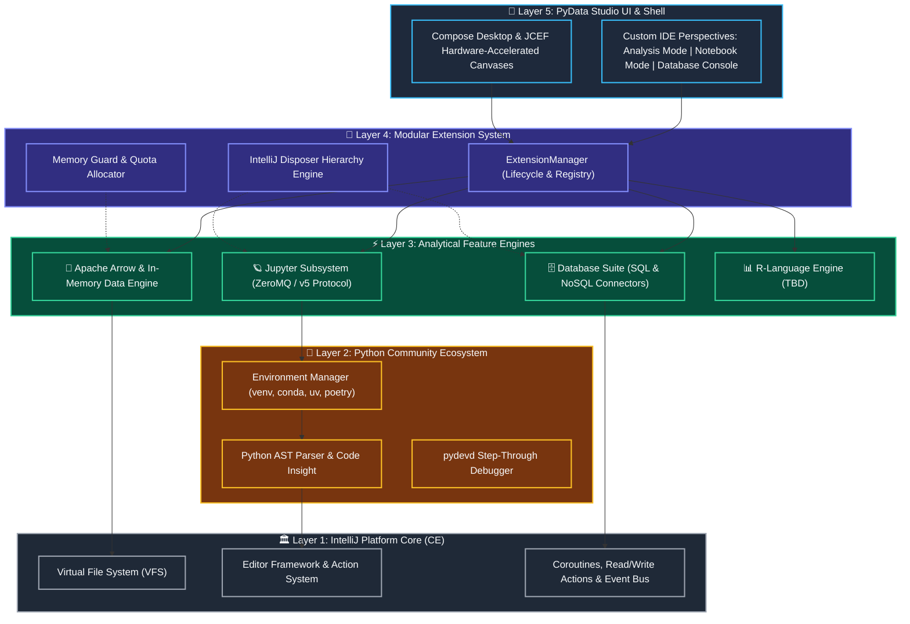
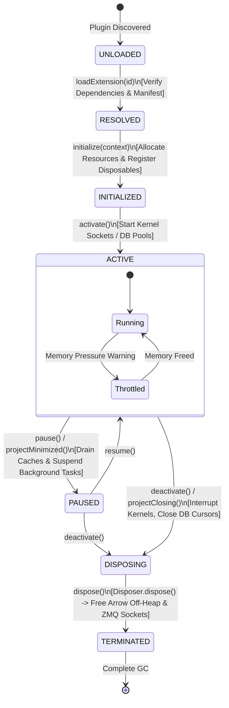
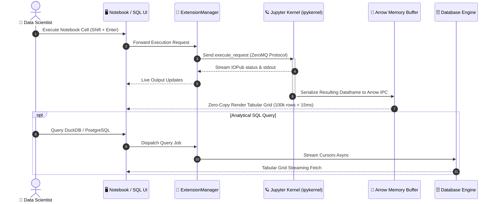
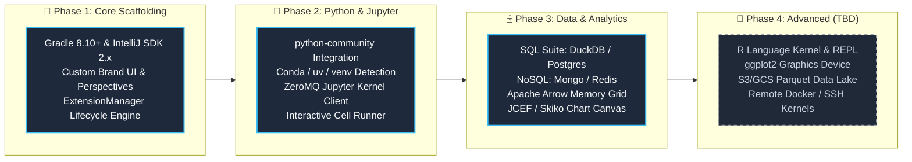

# 📊 PyData Studio 🚀

### *The Open-Source, Modularity-First IDE for Python, Data Science & Analytics*

[](https://github.com/JetBrains/intellij-community)
[](https://kotlinlang.org)
[](https://github.com/JetBrains/intellij-community/tree/master/python)
[](https://jupyter.org)
[](LICENSE)

---

## 🌟 1. Executive Summary & Project Brief

Modern data practitioners are caught between two disparate worlds:
- **Web-based Notebooks** (e.g. JupyterLab) offer immediate visualization and exploratory freedom, but fall short on refactoring, static typing, deep debugging, and enterprise-grade VCS.
- **Traditional Software Engineering IDEs** provide industrial-strength code intelligence, but treat notebooks, dataframes, and database exploration as secondary utilities or lock them behind expensive commercial paywalls.

**PyData Studio** bridges this divide. Built atop the open-source **IntelliJ Platform Community Edition** and JetBrains' open-source **Python Community** plugins, PyData Studio delivers a purpose-built, responsive environment tailored specifically for **Data Scientists**, **Analytics Engineers**, and **Machine Learning Practitioners**.

```
   ┌────────────────────────────────────────────────────────────────────────┐
   │                                                                        │
   │   🔬 EXPLORATORY AGILITY             🛠️ PRODUCTION ENGINEERING          │
   │   • Reactive Jupyter Notebooks       • PSI AST Code Refactoring        │
   │   • Tabular Dataframe Grids          • pydevd Step-Through Debugger    │
   │   • SQL/NoSQL Live Analytics         • Git & Merge Conflict Tools      │
   │   • In-Memory DuckDB / Polars        • Strict Typing & Linting (Ruff)  │
   │                                                                        │
   │                     ⚡ UNITED IN PYDATA STUDIO ⚡                      │
   └────────────────────────────────────────────────────────────────────────┘
```

---

## 🎨 2. Planned UI Mockups & Visual Design (Concept Targets)

> [!IMPORTANT]
> **🚧 Work-in-Progress (WIP) Notice: Concept Mockups Only**  
> The images shown below are **planned conceptual mockups and UI design targets**, **NOT** actual screenshots of the running software. PyData Studio is currently an active work-in-progress (WIP). These visual mockups illustrate the target user experience, interface layout, and aesthetic direction. As functional milestones are completed, these mockups will be progressively replaced with actual screenshots from live builds.

### 🖼️ Planned Mockup 1: Primary IDE Workspace (Interactive Notebook & Tabular Dataframe Explorer)
> *⚠️ Note: Planned Concept Mockup — Not an actual screenshot (Product WIP)*


**Planned Layout Highlights:**
1. **Left Activity Bar & Tree**: Project explorer, active Jupyter kernel manager, and live database connection status.
2. **Central Notebook Canvas**: Rich Markdown rendering, executable Python cells, and inline Seaborn/Matplotlib charts.
3. **Bottom Tabular Dataframe View**: Virtualized grid rendering with per-column distribution histograms, min/mean/max indicators, and quick-filter bars.
4. **Contextual Status Bar**: Real-time Python environment tag, kernel latency (`Idle 0.2s`), and memory consumption monitor.

---

### 🖼️ Planned Mockup 2: Analytical SQL/NoSQL Console & Visualizer
> *⚠️ Note: Planned Concept Mockup — Not an actual screenshot (Product WIP)*


**Layout Highlights:**
1. **Unified Schema Explorer**: Hierarchical introspection of PostgreSQL tables, DuckDB parquet catalogs, and MongoDB collections.
2. **Analytical Query Editor**: High-speed SQL editor with window function highlighting, smart autocomplete, and execution timer.
3. **Dual Data Grid & Charting Pane**: Side-by-side data grid inspection and interactive multi-series bar/line visualization.

---

### 🖼️ Mockup 3: Extension & Memory Management Control Center
*Dedicated control panel for managing active extensions, tracking off-heap memory, and monitoring resource quotas.*

```
┌──────────────────────────────────────────────────────────────────────────────────────────┐
│ 🧩 PyData Studio — Extension & Memory Manager                                    [—][□][✕]│
├──────────────────────────────────────────────────────────────────────────────────────────┤
│ Filter Extensions: [ Search active plugins...            ]   [ 🔄 Refresh ] [ ⚙️ Quotas ] │
├────────────────────────────────┬─────────┬──────────────┬──────────────┬────────────────┤
│ Extension Name                 │ State   │ Heap / Off   │ Thread Pool  │ Actions        │
├────────────────────────────────┼─────────┼──────────────┼──────────────┼────────────────┤
│ 🪐 Jupyter Kernel Subsystem    │ 🟢 Active│  48 MB / 0 MB│ 4 workers    │ [⏸️ Pause] [✕] │
│ 🗄️ DuckDB In-Memory Engine    │ 🟢 Active│ 112 MB / 2 GB│ 8 workers    │ [🧹 Trim]  [✕] │
│ 🏹 Apache Arrow Buffer Grid    │ 🟢 Active│  64 MB / 1 GB│ 2 workers    │ [🧹 Trim]  [✕] │
│ 🍃 MongoDB Document Connector  │ 🟡 Paused│  18 MB / 0 MB│ Idle         │ [▶️ Resume] [✕] │
│ 📈 JCEF Chart Canvas Bridge    │ 🟢 Active│  95 MB / 0 MB│ Render Thread│ [🔄 Reload][✕] │
│ 📊 R-Language Language Server  │ ⚪ Ready │   0 MB / 0 MB│ Unloaded     │ [⚡ Activate]   │
├────────────────────────────────┴─────────┴──────────────┴──────────────┴────────────────┤
│ 💾 Total Memory Governed: Heap 337 MB | Off-Heap 3.0 GB | JVM Quota: 8.0 GB (38% Used)   │
│ 🛡️ Lifecycle Health: All parent/child disposables linked • Zero orphan socket handles  │
└──────────────────────────────────────────────────────────────────────────────────────────┘
```

---

## 🎯 3. Scope of the Project

### 3.1 👥 Target Audience
- **Data Scientists & Machine Learning Engineers**: Developing predictive models, feature pipelines, and Jupyter exploratory workflows.
- **Analytics Engineers & Data Analysts**: Writing analytical SQL, exploring datasets with DuckDB/Polars, and debugging data transformations.
- **Python Engineers working with Data**: Creating data-intensive services, FastAPI endpoints, and ETL jobs.

### 3.2 ✅ In-Scope (Phase 1 / MVP)
- **IntelliJ Platform CE Base**: Custom branding, simplified data-first perspectives (Code, Notebook, Database).
- **Python Community Tooling**: Complete virtualenv support (`venv`, `conda`, `poetry`, `uv`), AST code insight, refactoring, and pydevd debugging.
- **Interactive Jupyter Subsystem**:
  - Full `.ipynb` notebook editor with split code/output cells.
  - ZeroMQ client communicating directly with local/remote Jupyter kernels.
  - Variable inspector showing type, shape, and memory consumption.
- **Database & Data Source Suite**:
  - SQL engine support: PostgreSQL, MySQL, SQLite, DuckDB, Snowflake.
  - NoSQL engine support: MongoDB, Redis.
  - Schema tree explorer, query console, and streaming tabular data grid.
- **Modular Extension Manager**:
  - Strict lifecycle states (`UNLOADED` &rarr; `ACTIVE` &rarr; `DISPOSING` &rarr; `TERMINATED`).
  - Memory bounds and IntelliJ `Disposable` hierarchy integration.

### 3.3 🔮 Follow-Up Scope (Phase 2 & Beyond)
- **R Language Integration (TBD)**: R kernel integration, R REPL, package viewer, and graphics device window.
- **Hardware-Accelerated Visualization**: WebGL/Skiko canvas for 10M+ datapoint scatterplots.
- **Cloud & Remote Execution**: S3/GCS data lake browser (Parquet inspection), SSH/Docker kernel runners.

---

## 🏗️ 4. Planned Architecture

PyData Studio is structured into five decoupled layers to ensure that high-memory data operations never freeze the core editor or leak system resources:



---

## 🔄 5. Extension Manager & Lifecycle Specification

Data science workflows manipulate multi-gigabyte memory buffers and long-lived network sockets. Unlike conventional plugins, extensions in PyData Studio operate under a **deterministic lifecycle state machine** governed by IntelliJ's `Disposable` infrastructure:



### 🛡️ Core Guarantees
1. **Memory Quota Enforcement**: If an extension exceeds its declared memory quota (e.g. holding uncompressed dataframes), `trimMemory()` is invoked automatically.
2. **Leak-Free Disposal**: Every extension implements `com.intellij.openapi.Disposable`. On project teardown, `Disposer.dispose(extension)` guarantees zero dangling threads, processes, or file descriptors.
3. **Crash Protection**: If an external kernel or database driver crashes, the Extension Manager captures the fault, isolates the module, and keeps the IDE editor responsive.

---

## 📡 6. Data & Execution Flow



---

## 🗺️ 7. Milestone Roadmap



| Phase | Milestone | Focus Areas | Deliverables |
| :--- | :--- | :--- | :--- |
| **Phase 1** | 🏛️ Platform Core | Shell, Branding, Extension Manager | IntelliJ CE base, module build system, `ExtensionManager` state machine, `Disposable` tree. |
| **Phase 2** | 🐍 Python & Notebooks | Runtime & Interactive REPL | `python-community` integration, environment switcher, ZeroMQ v5 client, `.ipynb` editor. |
| **Phase 3** | 📊 Data & Storage | Databases & Visuals | Multi-dialect SQL & NoSQL consoles, DuckDB in-memory queries, Arrow 1M-row virtualized grid. |
| **Phase 4** | 🔮 Expansion *(TBD)* | R Language & Cloud Lake | R kernel and REPL bridge, ggplot2 device canvas, S3/GCS Parquet browser, remote compute. |

---

## 💻 8. Technology Stack

| Component | Technology | Role & Purpose |
| :--- | :--- | :--- |
| **Platform Target** | 🏛️ IntelliJ Platform 2024.3+ CE | Industry standard IDE foundation, VFS, PSI indexing. |
| **IDE Language** | 🟣 Kotlin 2.1+ / Java 21 LTS | Native coroutines, type safety, high concurrency. |
| **Build Automation** | 🐘 Gradle 8.10+ | IntelliJ Platform Gradle Plugin 2.x compilation. |
| **Python Foundation** | 🐍 `python-community` plugin | AST analysis, virtual environments, pydevd engine. |
| **Interactive UI** | 🎨 Jetpack Compose Desktop & JCEF | Declarative UI, hardware-accelerated charting. |
| **Kernel Client** | 🪐 JeroMQ (ZeroMQ Java) | Asynchronous Jupyter protocol communications. |
| **Data Engine** | 🏹 Apache Arrow & DuckDB | High-speed zero-copy in-memory tabular operations. |

---

## 🚀 9. Getting Started & Development

### 📋 Prerequisites
- **JDK**: Java Development Kit 21 (Temurin or JetBrains Runtime).
- **Python**: Python 3.10+ installed and on `PATH`.
- **Git**: 2.30+.

### 🛠️ Building and Launching
```bash
# Clone the repository
git clone https://github.com/your-org/pydata-studio.git
cd pydata-studio

# Build all modules
./gradlew build

# Launch the IDE in development sandbox mode
./gradlew runIde
```

---

## 📄 10. License & Open Source Attribution

PyData Studio is distributed under the **Apache License 2.0**.
- Built upon the **IntelliJ Platform Community Edition** ([Apache 2.0](https://www.jetbrains.com/legal/licenses/open-source-licenses/)).
- Integrates the **IntelliJ Python Community Plugin** ([Apache 2.0](https://github.com/JetBrains/intellij-community/tree/master/python)).
- Implements the open-source **Jupyter Messaging Protocol** ([BSD 3-Clause](https://github.com/jupyter/jupyter_core/blob/main/COPYING.md)).
